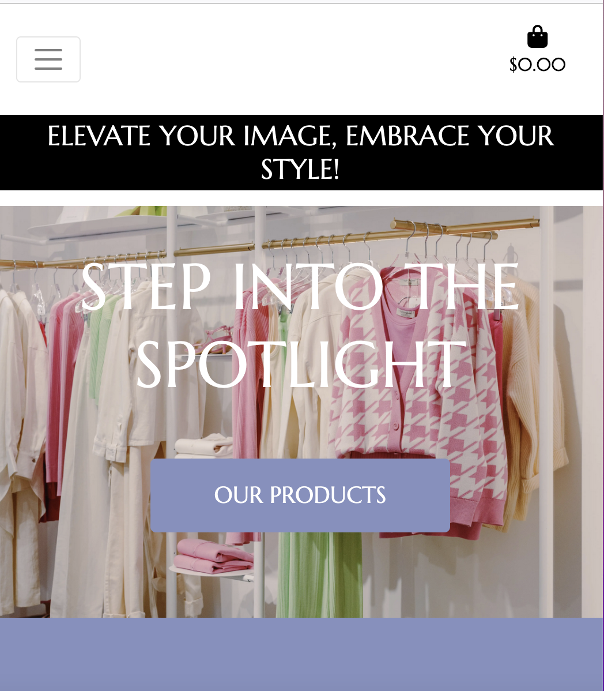

# Couture Hub website

[Visit the live site]().

The purpose of this application is to help users experience a fashion stylist's digital hub, with useful information of the services that are available, ebooks  while also being able to post articles, like them through the comment section.

* The Home page uses a striking image of a well-curated wardrobe takes center stage It not only adds visual appeal but also entices visitors to discover more. The "Our Products" button serves as an enticing call to action, guiding users to explore all the website offerings products and services.
*  The website has a blog in which all users can create edit or delete their own articles, like and comment on other perople's articles if logged in.
* All users with an account have acces to an e-commerce store where they can buy ebooks and services .
* If the first time user doesn't want to sign-up he can still read the articles.

***

## User Experience

### New User Stories

* As a new user, I want to be able to easily access a wealth of fashion expertise on the website. Whether I need fashion inspiration, tips, or want to enhance my style, the ebooks and services.
* I want to be able to access short fashion articles that can be read in a short amount of time.
* As a new user I want to be able to explore the different stylist services , designated to cater to my unique fashion sense, ot only that but be able to buy her ebook which adds a personalized touch . 

### Returning User Stories

* As a returning user, I want to be able to quickly access the future articlesto stay updated with the ever-evolving world of fashion.
* As a returning user, I want to be able to like and comment on the articles.
* As a returning user I want to be able to purchase more custom services  and receive special offers .

## Design

The site uses the Bootstrap framework. I used a light summer color palette with purple hues .
 It's a visual representation of elegance and expertise, inviting all visitors to explore the content, services, and products in a space that feels like a serene summer day.

#### Colours and Shades

* The site uses a white colour for the site’s header and for the testimony section which acts as a footerthe colour is purple navy .

* The color of the background is white and text is black for the menu and header while white is used in other partd of the website to reinforce the contrast and make it easier to read for all users.

* Dark shade of grey is used on the login page  / signup page.

* Other buttons in the site use dark shade of grey .

* Shopping Bag page uses black shade for text and black and white colour for buttons.

* Bootstrap's light blue (Primary) is used on the Updated button on the shopping bag page and the color red is used  for remove button on the same page.

* Bootstrap's green (Success) is used for top border color shopping cart and page.

* Bootstrap's red, orange  is used for the lines surrounding each article on the blog page.

* Bootstrap's blue is used for read button on blog page.

#### Typography

* The website logo has created using font family: 'Times New Roman' . This font was selected to make the logo stand out with an animation .

* For the rest of the body website the font family was :'Marcellus'[Marcellus font](https://fonts.google.com/specimen/Marcellus?query=marcellus) other text on the site uses the standard Bootstrap framework font stack, which consists of a number of simple, legible sans-serif fonts targeted at a range of different viewing devices.

#### Imagery

* [Font Awesome 6](https://fontawesome.com/) icons are used for the logo and the comment and like buttons.

* [Pexels](https://www.pexels.com) I used a photo from Pexels for the home page.(Photo by Ron Lach: https://www.pexels.com/photo/pink-and-white-long-sleeve-shirt-hanging-on-gold-and-white-clothing-rack-8386654/)

* [Pexels](https://www.pexels.com) I used a photo from Pexels for the profile of the website owner.(Photo by Moose Photos: https://www.pexels.com/photo/woman-in-pink-dress-using-laptop-computer-1586973/)

* [Pexels](https://www.pexels.com) I used an image from Pexels for the first ebook (Photo by Jung-Hua Liu: https://www.pexels.com/photo/abstract-painting-3063362/)

* [Pexels](https://www.pexels.com) I used a photo from Pexels for second ebook (Photo by Jaysen Scott: https://www.pexels.com/photo/woman-wearing-yellow-trench-coat-while-holding-purple-flower-1858488/)

* [Pexels](https://www.pexels.com) I used a photo from Pexels for the first product/service (Photo by Ricardo  Acevedo: https://www.pexels.com/photo/woman-wearing-blue-fur-coat-and-dress-1375736/)

* [Pexels](https://www.pexels.com) I used a photo from Pexels for the second product/service (Photo by Liza Summer: https://www.pexels.com/photo/anonymous-woman-choosing-outfit-in-store-6347546/)

## Wireframes

The site is responsively designed to adapt to the user's viewing device.

### Desktop view wireframe

 

### Mobile view wireframe

 

## Home Desktop view

 

 ## Mobile Home view

 
 
 ## Sign Up desktop view

   

  ## Log in mobile view

   

 ## Sign up mobile view

   
***

## Features

### User Accounts

Couture Hub is a web platform designed with user accounts specifically tailored for our fashion blog. Each user account is associated with a unique identifier, allowing users to interact with our blog features. These features include the ability to like and comment on posts created by other users. We've implemented a relational database schema to efficiently store user data and blog interactions. This functionality fosters an engaging community environment where fashion enthusiasts can share insights, ideas, and trends seamlessly within the web application.

* Users can create accounts if they want to use the blog by filling in a simple registration form.

* Users sign in to their accounts by filling in a login form.
* The application uses Django pre written authentication to handle user signup and login functionality.

### Create new articles

As a crucial key feature of Couture Hub, it has been integrated Full CRUD functionality for the blog articles. This system is designed to ensure that admin user have exclusive access to create, read, update, and delete articles, providing them with comprehensive control over the content. Admin user can effortlessly create new articles, edit existing ones, view the entire article database, and remove outdated content.

On the other hand, regular users are granted read-only access to articles. They can explore, like, comment, and engage with any of the articles available on our platform. This two-tiered approach enhances the user experience, allowing our admin user to curate and manage content while enabling all users to participate in discussions, share insights, and appreciate the fashion blog articles. This Full CRUD functionality, combined with user roles, ensures a well-structured and dynamic blogging environment on Couture Hub.

* New blog posts (articles) are added by completing a form, which is located with a button inside of all articles in the blog page .

* All articles are listed on the home page of the blog page but they need to be log in (Users only feature).

* Access to the blog is for users only . Inside of the blog page there will be a search bar(search for specific topics inside of the blog) allocated at the bottom of the page .

* If the person is not registered they will have this message show up .

* Admin user account : This is the only user that has access to write post on the blog .

* When editing an article

### Article management

* By design, users can only edit or delete their own  articles, as this prevents altering of other people's article posts. This allows the user to remain confident that their articles won't be tampered with.

## E-Commerce store

The second core feature of TrueFit is the e-commerce store available for signed-up users, where they can buy training programs and meal plans from the owner of the site. This works with [Stripe](https://stripe.com/)'s API .

* Customers can see a list of the available digital products in the training/diet plans section of the site.

* Alternatively if the customer wishes to filter the products based on category they can use the dropdown menu at the top

### Shopping bag

The shopping bag allows to see the user to see the total amount of the purchase before proceeding to checkout and it also has the functionality to update and remove the quantity of products

### Checkout

The checkout page has a form that collects the necessary data from the customer to create a payment intent with Stripe's API, it also uses Stripe's data validation to prevent the user from submitting the incorrec data which would prevent the order from submitting

* A very important feature of the checkout process is that TrueFit uses webhooks to protects the owner of the site of having payments going through without orders being submitted to the database. If the buyer closes the window while the order is still being processed, Stripe will save a copy of the order and update the database accordingly later on.

---
***

## Database Design

TrueFit uses a SQL database. Data is divided into seven collections, with the following schema:

***

## Future Features

The following features could be added in the future, given more development time:

### 1. Account Management Tools

* Helpful account management tools could be provided, such as the ability to update usernames, email addresses and passwords.
* A password recovery by email function could also be provided. Django authentication tools could be used for this.

### 2. Article Filters

* The ability for all users to filter the articles by category.

 

### 4. Chat functionality

* The ability to chat with other users of the blog. Django channels could be used for this.

### 5. Code optimization and refactoring

* This was my first major project using Python and Django, so there are a few areas where I feel the code could be made neater and more efficient.
* In particular, replacing some function based views with class based view

***

## Technologies

### Languages Used

* [HTML5](https://en.wikipedia.org/wiki/HTML5)
* [CSS3](https://en.wikipedia.org/wiki/CSS)
* [JavaScript](https://en.m.wikipedia.org/wiki/JavaScript)
* [Python](https://en.m.wikipedia.org/wiki/Python_(programming_language))

### Frameworks, Libraries & Programs Used

1. [GitHub](https://github.com/) - Used for version control.
2. [GitPod](https://gitpod.io/) - Used to write all code and test before deploying to GitHub.
3. [Balsamiq](https://balsamiq.com/) - Used to produce design wireframes.
4. [Bootstrap4](https://bootstrap.com/) - Bootstrap 4 CSS framework used extensively to create layout and styling of site.
5. [Python 3.8](https://www.python.org/) - Used to code the application.
6. [ElephantSQL](https://www.elephantsql.com/) - Used for the application's database.
7. [Django](https://www.djangoproject.com/) - Used to build the main application structure and page templates 
8. [Django storages](https://django-storages.readthedocs.io/en/latest/) - Used to connect web app with Amazon AWS S3 Bucket
9. [AWS](https://aws.com) Used to store static files
9. [Heroku](https://heroku.com/) - Used to deploy the site.
10. [W3C.org](https://www.w3.org/) - W3C [HTML Validator](https://validator.w3.org/nu/) and [CSS Validator](https://jigsaw.w3.org/css-validator/validator) used to check HTML and CSS code for errors.
11. [JSHint](https://jshint.com/) - Used to check JavaScript for errors.
12. [Pycodestyle](https://pypi.org/project/pycodestyle/) - Used to check Python code for errors.
13. [ChatGPT](https://chat.openai.com/chat) - Used to generate dummy articles and to explain and check code
14. [Stripe](https://stripe.com/) - Used to accept donations

***
