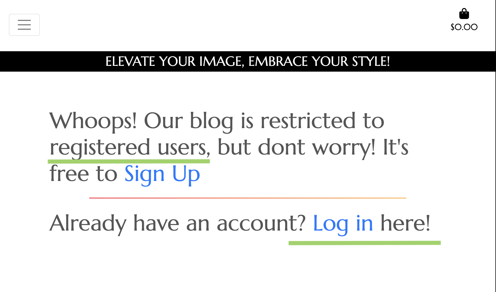
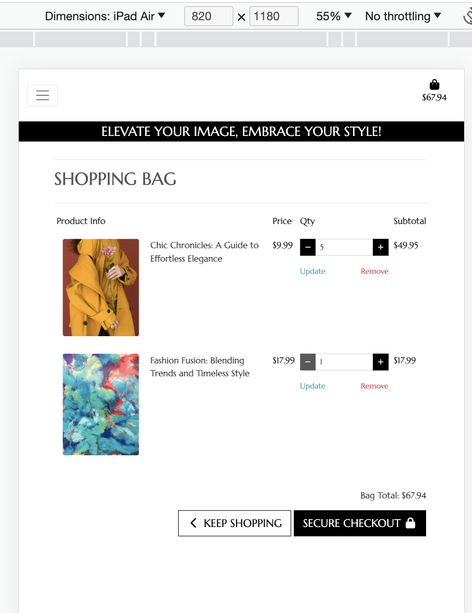

# Couture Hub website

[Visit the live site](https://couture-hub-d0fb29d40e9a.herokuapp.com/).

The purpose of this application is to help users experience a fashion stylist's digital hub, with useful information of the services that are available, ebooks  while also being able to post articles, like them through the comment section.

* The Home page uses a striking image of a well-curated wardrobe takes center stage It not only adds visual appeal but also entices visitors to discover more. The "Our Products" button serves as an enticing call to action, guiding users to explore all the website offerings products and services.
*  The website has a blog in which all users can create edit or delete their own articles, like and comment on other perople's articles if logged in.
* All users with an account have acces to an e-commerce store where they can buy ebooks and services .
* If the first time user doesn't want to sign-up he can still read the articles.

***

## User Experience

### New User Stories

* As a new user, I want to be able to easily access a wealth of fashion expertise on the website. Whether I need fashion inspiration, tips, or want to enhance my style, the ebooks and services.
* I want to be able to access short fashion articles that can be read in a short amount of time.
* As a new user I want to be able to explore the different stylist services , designated to cater to my unique fashion sense, ot only that but be able to buy her ebook which adds a personalized touch . 

### Returning User Stories

* As a returning user, I want to be able to quickly access the future articlesto stay updated with the ever-evolving world of fashion.
* As a returning user, I want to be able to like and comment on the articles.
* As a returning user I want to be able to purchase more custom services  and receive special offers .

## Design

The site uses the Bootstrap framework. I used a light summer color palette with purple hues .
 It's a visual representation of elegance and expertise, inviting all visitors to explore the content, services, and products in a space that feels like a serene summer day.

#### Colours and Shades

* The site uses a white colour for the site’s header and for the testimony section which acts as a footerthe colour is purple navy .

* The color of the background is white and text is black for the menu and header while white is used in other partd of the website to reinforce the contrast and make it easier to read for all users.

* Dark shade of grey is used on the login page  / signup page.

* Other buttons in the site use dark shade of grey .

* Shopping Bag page uses black shade for text and black and white colour for buttons.

* Bootstrap's light blue (Primary) is used on the Updated button on the shopping bag page and the color red is used  for remove button on the same page.

* Bootstrap's green (Success) is used for top border color shopping cart and page.

* Bootstrap's red, orange  is used for the lines surrounding each article on the blog page.

* Bootstrap's blue is used for read button on blog page.

#### Typography

* The website logo has created using font family: 'Times New Roman' . This font was selected to make the logo stand out with an animation .

* For the rest of the body website the font family was :'Marcellus'[Marcellus font](https://fonts.google.com/specimen/Marcellus?query=marcellus) other text on the site uses the standard Bootstrap framework font stack, which consists of a number of simple, legible sans-serif fonts targeted at a range of different viewing devices.

#### Imagery

* [Font Awesome 6](https://fontawesome.com/) icons are used for the logo and the comment and like buttons.

* [Pexels](https://www.pexels.com) I used a photo from Pexels for the home page.(Photo by Ron Lach: https://www.pexels.com/photo/pink-and-white-long-sleeve-shirt-hanging-on-gold-and-white-clothing-rack-8386654/)

* [Pexels](https://www.pexels.com) I used a photo from Pexels for the profile of the website owner.(Photo by Moose Photos: https://www.pexels.com/photo/woman-in-pink-dress-using-laptop-computer-1586973/)

* [Pexels](https://www.pexels.com) I used an image from Pexels for the first ebook (Photo by Jung-Hua Liu: https://www.pexels.com/photo/abstract-painting-3063362/)

* [Pexels](https://www.pexels.com) I used a photo from Pexels for second ebook (Photo by Jaysen Scott: https://www.pexels.com/photo/woman-wearing-yellow-trench-coat-while-holding-purple-flower-1858488/)

* [Pexels](https://www.pexels.com) I used a photo from Pexels for the first product/service (Photo by Ricardo  Acevedo: https://www.pexels.com/photo/woman-wearing-blue-fur-coat-and-dress-1375736/)

* [Pexels](https://www.pexels.com) I used a photo from Pexels for the second product/service (Photo by Liza Summer: https://www.pexels.com/photo/anonymous-woman-choosing-outfit-in-store-6347546/)

## Wireframes

The site is responsively designed to adapt to the user's viewing device.

### Desktop view wireframe

 

### Mobile view wireframe

 

## Home Desktop view

 

 ## Mobile Home view

 
 
 ## Sign Up desktop view

   

  ## Log in mobile view

   

 ## Sign up mobile view

   
***

## Features

### User Accounts

Couture Hub is a web platform designed with user accounts specifically tailored for our fashion blog. Each user account is associated with a unique identifier, allowing users to interact with our blog features. These features include the ability to like and comment on posts created by other users. We've implemented a relational database schema to efficiently store user data and blog interactions. This functionality fosters an engaging community environment where fashion enthusiasts can share insights, ideas, and trends seamlessly within the web application.

* Users can create accounts if they want to use the blog by filling in a simple registration form.

* Users sign in to their accounts by filling in a login form.
* The application uses Django pre written authentication to handle user signup and login functionality.

### Create new articles

As a crucial key feature of Couture Hub, it has been integrated Full CRUD functionality for the blog articles. This system is designed to ensure that admin user have exclusive access to create, read, update, and delete articles, providing them with comprehensive control over the content. Admin user can effortlessly create new articles, edit existing ones, view the entire article database, and remove outdated content.

On the other hand, regular users are granted read-only access to articles. They can explore, like, comment, and engage with any of the articles available on our platform. This two-tiered approach enhances the user experience, allowing our admin user to curate and manage content while enabling all users to participate in discussions, share insights, and appreciate the fashion blog articles. This Full CRUD functionality, combined with user roles, ensures a well-structured and dynamic blogging environment on Couture Hub.

* New blog posts (articles) are added by completing a form, which is located with a button inside of all articles in the blog page .

* All articles are listed on the home page of the blog page but they need to be log in (Users only feature).

* Access to the blog is for users only . Inside of the blog page there will be a search bar(search for specific topics inside of the blog) allocated at the bottom of the page .

* If the person is not registered they will have this message show up .

* Admin user account : This is the only user that has access to write post on the blog .

* When editing an article

### Article management

* Admin users are granted Full CRUD access on this website to ensure content quality, data integrity, and security. This approach minimizes the risk of unauthorized changes and data breaches, as admin users are accountable for content and user interactions. By separating content management from user engagement,we provide a more secure and efficient experience for all users.

## E-Commerce store

This is another key feature of Couture Hub website ,it has not only a blog page but an e-commerce store available for everyone (Customers dont need to have an account to have access to the store products). This procedure its done and works with Stripe [Stripe](https://stripe.com/)'s API .

* Customers can see all the available products in the STORE page.

### Shopping Bag

The shopping bag feature is a central element of the platform store, allowing customers to easily manage their selections. With this feature, customers can change(update) the quantity of items in their bag and remove items if they no longer wish to purchase. It offers a seamless and user-friendly shopping experience.

### Checkout

The checkout page has a form which will collect all the customers necessary data . This data is crucial for creating a payment intent using Stripe's API, ensuring a secure and efficient payment process.Additionally, it has been integrated Stripe's data validation mechanisms to prevent users from submitting incorrect information. 

* Another feature of the checkout is the use of webhooks as this will act as a safety net that ensures that payment-related data and events are reliably captured and processed, even if interruptions occur on the user's end or with the website's operation. This contributes to a more robust and resilient payment system.

---
***

## Website Database Design

Couture Hub website uses a .. database. Data is divided into seven collections, with the following schema:

***

## Future Features

The following features could be added in the future, given more development time:

### 1. Admin Account :

* the admin account could have more options to updated other users details .

### 2. User Profiles and Preferences:

* The ability for all users profiles can create and customize their profiles, including a wishlist.

### 3. Advanced Search and Filtering:

* Implementing full-text search and filters on the website website(not only on the blog page) will significantly improve the user's ability to find specific items quickly and easily.

### 4. Chat Within Comments Section:

*  Enhance user interactions by allowing them to engage in real-time conversations within the comments section. This interactive feature not only improves user engagement but also creates a dynamic and social shopping experience, where users can connect.

### 5.Social Media Integration: 

* Implementing social media authentication for login or registration(social media APIs, implementing OAuth for authentication, and building sharing functionality) This will help to gather valuable user data from social media profiles to personalize recommendations and improve marketing strategies.

## Technologies

### Languages Used

* [HTML5](https://en.wikipedia.org/wiki/HTML5)
* [CSS3](https://en.wikipedia.org/wiki/CSS)
* [JavaScript](https://en.m.wikipedia.org/wiki/JavaScript)
* [Python](https://en.m.wikipedia.org/wiki/Python_(programming_language))

### Frameworks, Libraries & Programs Used

1. [GitHub](https://github.com/) - Used for version control.
2. [GitPod](https://gitpod.io/) - Used to write all code and test before deploying to GitHub.
3. [Figma](https://www.figma.com) - Used to produce design wireframes.
4. [Bootstrap4](https://bootstrap.com/) - Bootstrap 4 CSS framework used extensively to create layout and styling of site.
5. [Python 3.8](https://www.python.org/) - Used to code the application.
6. [ElephantSQL](https://www.elephantsql.com/) - Used for the application's database.
7. [Django](https://www.djangoproject.com/) - Used to build the main application structure and page templates 
8. [Django storages](https://django-storages.readthedocs.io/en/latest/) - Used to connect web app with Amazon AWS S3 Bucket
9. [AWS](https://aws.com) Used to store static files
9. [Heroku](https://heroku.com/) - Used to deploy the site.
10. [W3C.org](https://www.w3.org/) - W3C [HTML Validator](https://validator.w3.org/nu/) and [CSS Validator](https://jigsaw.w3.org/css-validator/validator) used to check HTML and CSS code for errors.
11. [JSHint](https://jshint.com/) - Used to check JavaScript for errors.
12. [Pycodestyle](https://pypi.org/project/pycodestyle/) - Used to check Python code for errors.
13. [ChatGPT](https://chat.openai.com/chat) - Used to assist  in generating ideas, content.
14. [Stripe](https://stripe.com/) - Used to accept form of payment in the checkout.

***

## Testing

## Functionality testing 

 I used Chrome developer tools throughout the project for testing the website and solving problems with responsiveness and style issues.

## Compatibility testing
 * Site was tested across multiple virtual mobile devices and different browsers. This was also checked in Chrome developer tools. 

 
 * The website was tested on different devices such as: Ipad air with iOS, Iphone 13 mini with iOS 17, Macbook air with MacOS .

 

 

 

## Unit Tests

I created unit tests for the login and signup page with django tests

---
# Issues found during site development

* ## Edit Article view creating additional article instead of editing existing one

When editing existing articles, once the "Update" button was clicked, the edit article view would create an aditional article onto the database instead of updating the existing one

> This was due to the action attribute on the form pointing to the "articles:create" url, as I had copy the form from the article_create html template and had forgotten to delete this, all I had to do to fix this error was to delete the action as shown on the picture bellow.

* ## Secret Key being exposed

When first creating my project I forgot to add the sqlite database to the .gitignore which cause django's secret key to be exposed when pushing to github

> Thankfully gitguardian let me know almost instantly that it had happened, so I generated a new secret key and made sure to add the sqlite database to the .gitignore before pushing to github.

* ##  Images not loading from Amazon s3 bucket.

This one was a tough one to spot as I was sure that I had followed step by step the tutorial on storing static files on my amazon bucket. When I uploaded my files to my amazon bucket, the deployed site was not displaying any images despite the css styling being applied, telling me that the error was exclusively with the images and not all staticfiles.

> I have to give credit to the amazing CodeInstitute Slack comunity, which guided me in the right direction, it turns out that the url configuration is specific to the Region where the bucket is, and unlike the US region where the url just ends in ".s3.amazonaws.com" for the EU region the region has to also be added to the url, like the image shows below

* ## Webhooks breaking the order submission

As a result of changing the STRIPE_CURRENCY variable at an early stage of the process, the deployed site would get stuck on the loading overlay (Check image) and the order would never be sibmitted to the database, it was very challenging to debug as there was no error to display or console to check as it was only happening on the deplyed site

## Performance testing

I run [Lighthouse](https://developers.google.com/web/tools/lighthouse/) tool to check performance of the website.
Screenshots are presented below:

Final results:

I noticed that this tests scores vary from time to time and depends on external libraries as well. 

## Code Validation
 I used this websites to validate my code:
 
 * [W3C CSS Validator](https://jigsaw.w3.org/css-validator/) to validate CSS

 

 * [Nu Html Checker](https://validator.w3.org/) to test HTML

 

 
 * [Pycodestyle](https://pypi.org/project/pycodestyle/) to test python files

## DEPLOYMENT
**Step 1:** Create a new app in Heroku, choose a unique name and region.
**Step 2:** Login to ElephantSQL, access the dashboard and create a new instance (input a name, select a region).
**Step 3:** Return to dashboard, copy the database URL:

**Step 4:** Create env.py file (ensure it is included in .gitignore file) and add environment the below variables. Paste the URL from above:

**Step 5:** Include a secret key in the variables:

**Step 6:** Include the below code to settings.py file:

**Step 7:** Link the database in settings.py and migrate then push to GitHub:

**Step 8:** In Heroku, add three config vars:

**Step 9:** Login to Cloudinary, copy the API Environmental variable to dashboard and add to env.py (see screenshot above) & to Heroku config vars:

**Step 10:** Add cloudinary to installed apps in settings.py, add static/media file settings:

**Step 11:** Add template directories in settings.py, add Heroku host name to allowed hosts and add directory files:

**Step 12:** Create a Procfile, then commit and push to GitHub:

**Step 13:** Connect GitHub account in Heroku, connect and deploy branch. Open app and check:

## Other Credits and Acknowledgements

* [Code Institute](https://codeinstitute.net/) for their helpful lessons and reference materials.
* [Code Institute Sample README](https://github.com/Code-Institute-Solutions/SampleREADME/blob/master/README.md) for the structure of this project's documentation and parts of the GitHub forking and cloning processes.

